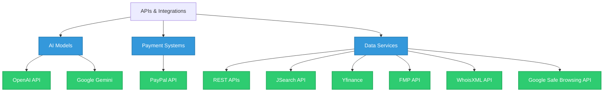

<!-- Header Section with Dynamic SVG -->

  

<!-- Divider with animation -->

<!-- About Me Section -->
##  About Me

<!-- Adjusted coder GIF to avoid overflow -->

- 🔭 **Currently working on:** AI-powered applications and full-stack web development
- 🎓 **Education:** Computer Science at Simon Fraser University
- 💼 **Experience:** Building end-to-end solutions with modern tech stacks
- 🌱 **Currently learning:** Advanced AI models integration, System Design
- 🚀 **Passionate about:** Clean code, automation, and startups
- ⚡ **Fun fact:** I enjoy building products that matter while drinking terrible coffee

<!-- Tech Stack Section -->
## 🛠️ Technology Arsenal

<b>Languages & Frameworks</b>

 

<!-- Programming Languages -->
<table>
  <tr>
    <td align="center" width="96">
      
       Python
    </td>
    <td align="center" width="96">
      
       TypeScript
    </td>
    <td align="center" width="96">
      
       C++
    </td>
    <td align="center" width="96">
      
       JavaScript
    </td>
    <td align="center" width="96">
      
       SQL
    </td>
    <td align="center" width="96">
      
       C
    </td>
    <td align="center" width="96">
      
       HTML5
    </td>
    <td align="center" width="96">
      
       CSS3
    </td>
  </tr>
</table>

<!-- Frameworks & Libraries -->
<table>
  <tr>
    <td align="center" width="96">
      
       React
    </td>
    <td align="center" width="96">
      
       Node.js
    </td>
    <td align="center" width="96">
      
       Express
    </td>
    <td align="center" width="96">
      
       Koa
    </td>
    <td align="center" width="96">
      
       FastAPI
    </td>
    <td align="center" width="96">
      
       Flask
    </td>
    <td align="center" width="96">
      
       TensorFlow
    </td>
    <td align="center" width="96">
      
       OpenCV
    </td>
  </tr>
</table>

<b>APIs & Integrations</b>

 

<b>Tools & DevOps</b>

 

<table>
  <tr>
    <td align="center" width="96">
      
       GitHub
    </td>
    <td align="center" width="96">
      
       Docker
    </td>
    <td align="center" width="96">
      
       Git
    </td>
    <td align="center" width="96">
      
       GitLab
    </td>
    <td align="center" width="96">
      
       Linux
    </td>
    <td align="center" width="96">
      
       VS Code
    </td>
    <td align="center" width="96">
      
       Figma
    </td>
    <td align="center" width="96">
      
       MongoDB
    </td>
    <td align="center" width="96">
      
       Multer
    </td>
  </tr>
</table>

<!-- GitHub Stats Section -->
## 📊 GitHub Analytics

  
  

<!-- GitHub Activity Graph -->

  

<!-- Metrics Section -->
## 🧮 GitHub Metrics

  

<!-- Visitor Count -->
## 🧮 Visitor Count

  

<!-- Footer -->

  

