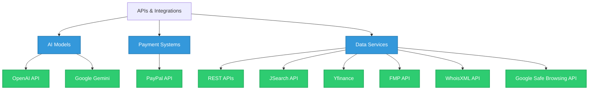

<!-- Header Section with Dynamic SVG -->

<!-- Divider with animation -->

<!-- About Me Section -->
##  About Me

<!-- Adjusted coder GIF to avoid overflow -->

- 🔭 **Currently working on:** AI-powered applications and full-stack web development
- 🎓 **Education:** Computer Science at Simon Fraser University
- 💼 **Experience:** Building end-to-end solutions with modern tech stacks
- 🌱 **Currently learning:** Advanced AI models integration, System Design
- 🚀 **Passionate about:** Clean code, automation, and startups
- ⚡ **Fun fact:** I enjoy building products that matter while drinking terrible coffee

<!-- Tech Stack Section -->
## 🛠️ Technology Arsenal

<b>Languages & Frameworks</b>

 

<!-- Programming Languages -->
<table>
  <tr>
    <td align="center" width="96">
      
       Python
    </td>
    <td align="center" width="96">
      
       TypeScript
    </td>
    <td align="center" width="96">
      
       C++
    </td>
    <td align="center" width="96">
      
       JavaScript
    </td>
    <td align="center" width="96">
      
       SQL
    </td>
    <td align="center" width="96">
      
       C
    </td>
    <td align="center" width="96">
      
       HTML5
    </td>
    <td align="center" width="96">
      
       CSS3
    </td>
  </tr>
</table>

<!-- Frameworks & Libraries -->
<table>
  <tr>
    <td align="center" width="96">
      
       React
    </td>
    <td align="center" width="96">
      
       Node.js
    </td>
    <td align="center" width="96">
      
       Express
    </td>
    <td align="center" width="96">
      
       Next.js
    </td>
    <td align="center" width="96">
      
       FastAPI
    </td>
    <td align="center" width="96">
      
       Flask
    </td>
    <td align="center" width="96">
      
       TensorFlow
    </td>
    <td align="center" width="96">
      
       OpenCV
    </td>
  </tr>
</table>

<b>APIs & Integrations</b>

 

<b>Tools & DevOps</b>

 

<table>
  <tr>
    <td align="center" width="96">
      
       GitHub
    </td>
    <td align="center" width="96">
      
       Docker
    </td>
    <td align="center" width="96">
      
       Git
    </td>
    <td align="center" width="96">
      
       GitLab
    </td>
    <td align="center" width="96">
      
       Linux
    </td>
    <td align="center" width="96">
      
       VS Code
    </td>
    <td align="center" width="96">
      
       Figma
    </td>
    <td align="center" width="96">
      
       MongoDB
    </td>
    <td align="center" width="96">
      
       Multer
    </td>
  </tr>
</table>

<!-- GitHub Stats Section -->
## 📊 GitHub Analytics

<!-- GITHUB STATISTICS: Visual analytics with enhanced design -->
<h2 align="center">📊 GitHub Analytics</h2>

  <em>A visual representation of my GitHub activity and contributions</em>

 

  <picture>
    <source 
      srcset="https://github-readme-stats.vercel.app/api?username=AlexanderPotiagalov&show_icons=true&theme=tokyonight&hide_border=true&bg_color=0D1117&title_color=38BDAE&icon_color=38BDAE&text_color=FFFFFF"
      media="(prefers-color-scheme: dark)"
    />
    <source
      srcset="https://github-readme-stats.vercel.app/api?username=AlexanderPotiagalov&show_icons=true&theme=buefy&hide_border=true"
      media="(prefers-color-scheme: light), (prefers-color-scheme: no-preference)"
    />
    
  </picture>
  
  <picture>
    <source 
      srcset="https://github-readme-streak-stats.herokuapp.com/?user=AlexanderPotiagalov&theme=tokyonight&hide_border=true&background=0D1117&ring=38BDAE&fire=38BDAE&currStreakLabel=38BDAE"
      media="(prefers-color-scheme: dark)"
    />
    <source
      srcset="https://github-readme-streak-stats.herokuapp.com/?user=AlexanderPotiagalov&theme=buefy&hide_border=true"
      media="(prefers-color-scheme: light), (prefers-color-scheme: no-preference)"
    />
    
  </picture>

 

  <picture>
    <source 
      srcset="https://github-readme-activity-graph.vercel.app/graph?username=AlexanderPotiagalov&bg_color=0D1117&color=38BDAE&line=2563EB&point=FFFFFF&area=true&hide_border=true"
      media="(prefers-color-scheme: dark)"
    />
    <source
      srcset="https://github-readme-activity-graph.vercel.app/graph?username=AlexanderPotiagalov&bg_color=FFFFFF&color=118D9C&line=4C71F2&point=118D9C&area=true&hide_border=true"
      media="(prefers-color-scheme: light), (prefers-color-scheme: no-preference)"
    />
    
  </picture>

  <picture>
    <source 
      srcset="https://github-profile-trophy.vercel.app/?username=AlexanderPotiagalov&theme=algolia&no-frame=true&row=1&column=7"
      media="(prefers-color-scheme: dark)"
    />
    <source
      srcset="https://github-profile-trophy.vercel.app/?username=AlexanderPotiagalov&theme=flat&no-frame=true&row=1&column=7"
      media="(prefers-color-scheme: light), (prefers-color-scheme: no-preference)"
    />
    
  </picture>

<!-- Metrics Section -->
## 🧮 GitHub Metrics

  

<!-- CONNECT WITH ME: Interactive call-to-action -->
<h2 align="center">🤝 Let's Connect</h2>

  <em>I'm always open to interesting conversations and collaboration opportunities</em>

  
  
  

<!-- CODING QUOTE: Inspirational element -->
 

  <table>
    <tr>
      <td width="150px">
        
      </td>
      <td>
        <picture>
          <source media="(prefers-color-scheme: dark)" srcset="https://quotes-github-readme.vercel.app/api?type=horizontal&theme=tokyonight">
          
        </picture>
      </td>
      <td width="150px">
        
      </td>
    </tr>
  </table>

<!-- VISITOR COUNTER: Interactive element -->
<h2 align="center">👥 Visitor Counter</h2>

  

<!-- Footer -->

  

 

  

